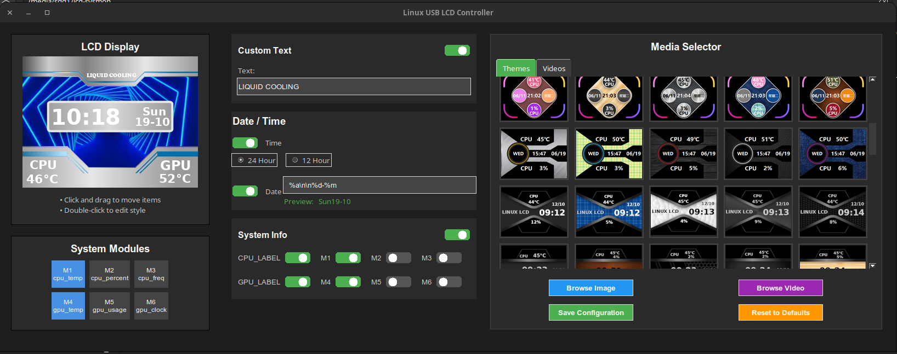
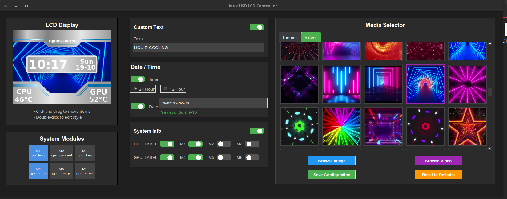

# LCD System Monitor (Linux Driver + GUI)

[](https://github.com/the-black-eagle/Thermalright-usblcd/actions/workflows/build-appimage.yml)
[](https://github.com/the-black-eagle/Thermalright-usblcd/releases/latest)
[](LICENSE)

Native Linux driver and GUI for the Thermalright USB LCD system monitor. Display real-time system stats, custom images, and videos on your Thermalright LCD panel.

---

## ✨ Features

- 🖼️ **440 static themes** + **596 video backgrounds** included
- 📊 **Real-time system monitoring** - CPU, GPU, RAM, temps, network stats
- 🎨 **Alpha channel support** - Videos play through transparent image areas
- 🕐 **Customizable date/time** formatting with multi-line support (`\n`)
- 💾 **System tray mode** - Minimize to background, keeps LCD updated
- 🐧 **Pure Linux native** - No Wine, no Windows dependencies
- ⚡ **AppImage available** - Download and run, no installation needed

---

## ⚠️ Hardware Compatibility

**This driver ONLY works with:**
- **Vendor ID:** `0x0402` (ALi Corp)
- **Product ID:** `0x3922`
- **Device Name:** ALi Corp. USBLCD

### Check if you have compatible hardware:
```bash
lsusb | grep "0402:3922"
```

If you see output like `Bus 001 Device 005: ID 0402:3922 ALi Corp. USBLCD`, you're good to go!  
If not, this driver won't work with your device.

> **Note:** Thermalright has no plans to provide official Linux drivers. This is a community-built alternative that replicates the Windows software functionality.

---

## ⚡ Quick Install (AppImage)

Download the latest pre-built AppImage from the [**Releases**](https://github.com/the-black-eagle/Thermalright-usblcd/releases/latest) page.

```bash
# Download latest AppImage (replace version number with current release)
wget https://github.com/the-black-eagle/Thermalright-usblcd/releases/latest/download/tr-driver-1.1.0-2-x86_64.AppImage

# Make it executable
chmod +x tr-driver-*.AppImage

# Run it
./tr-driver-*.AppImage
```

That's it — no installation required! The AppImage bundles all dependencies and works on most modern Linux distributions.

### Automatic download of latest version:
```bash
# Automatically fetch the latest AppImage URL
wget $(curl -s https://api.github.com/repos/the-black-eagle/Thermalright-usblcd/releases/latest | grep "browser_download_url.*AppImage" | cut -d '"' -f 4)
chmod +x tr-driver-*.AppImage
./tr-driver-*.AppImage
```

---

## 🧱 Build Status & Releases

- **Build AppImage:** Shows the current CI build status for the latest tagged release
- **Latest AppImage:** Links directly to the most recent prebuilt AppImage binary
- **License:** Indicates the open-source license for this project

These badges update automatically when a new tag is pushed or a release is published.

---

## ⚙️ Requirements

### System
- Linux (tested on Ubuntu 24.04, GNOME/Mutter)
- USB access to the LCD device (see Troubleshooting for permissions)

### Build Dependencies

| Dependency | Purpose | Install (Ubuntu/Debian) | Link |
|------------|---------|--------------------------|------|
| **g++ / clang++** | Build C++17 code | `sudo apt install g++` | [GCC](https://gcc.gnu.org/) |
| **CMake ≥ 3.16** | Build system | `sudo apt install cmake` | [CMake](https://cmake.org/download/) |
| **libusb-1.0** | USB device access | `sudo apt install libusb-1.0-0-dev` | [libusb](https://libusb.info/) |
| **Python 3.10+** | Frontend GUI | `sudo apt install python3 python3-dev python3-pip` | [Python](https://www.python.org/) |
| **pybind11** | Python bindings | `sudo apt install pybind11-dev` | [pybind11](https://github.com/pybind/pybind11) |
| **pybind11_json** | JSON conversion | [Download header](https://raw.githubusercontent.com/pybind/pybind11_json/master/include/pybind11_json/pybind11_json.hpp) to `/usr/local/include/` | [pybind11_json](https://github.com/pybind/pybind11_json) |
| **nlohmann/json** | JSON handling (C++) | `sudo apt install nlohmann-json3-dev` | [nlohmann/json](https://github.com/nlohmann/json) |
| **OpenCV** | Image/frame processing | `sudo apt install libopencv-dev` | [OpenCV](https://opencv.org/) |

### Install pybind11_json (header-only):
```bash
sudo wget -O /usr/local/include/pybind11_json.hpp \
  https://raw.githubusercontent.com/pybind/pybind11_json/master/include/pybind11_json/pybind11_json.hpp
```

---

## 🔨 Build & Run

### Quick start (one-liner)
```bash
git clone https://github.com/the-black-eagle/Thermalright-usblcd.git
cd Thermalright-usblcd
mkdir build && cd build
cmake ..
make lcd_test
```

👉 `make lcd_test` will **build** the backend and **launch** the Python GUI in one step.

---

### Step-by-step (if you prefer)
```bash
git clone https://github.com/the-black-eagle/Thermalright-usblcd.git
cd Thermalright-usblcd
mkdir build && cd build
cmake ..
make lcd_driver              # Build C++ backend only
python3 ../python/gui_controller.py
```

---

## 🎯 Build Targets

```bash
make lcd_driver    # Build C++ backend module only
make lcd_test      # Build backend + run GUI for testing
make appimage      # Package as portable AppImage
make deb           # Prepare Debian package staging directory
```

---

## 📂 Project Structure

```
Thermalright-usblcd/
├── src/
│   ├── CLcdDriver.cpp       # Main driver implementation
│   ├── CLcdDriver.h         # Driver header
│   └── bindings.cpp         # Python bindings
├── python/
│   ├── gui_controller.py    # Main GUI application
│   ├── background_selector.py  # Media picker dialog
│   └── themed_messagebox.py    # Themed message boxes
├── USBLCD/                  # Media library
│   ├── images/              # 440 static theme images
|       └── *.json           # Theme configuration files
│   ├── videos/              # 596 video files
├── docs/
│   └── screenshots/         # Documentation images
├── .github/
│   └── workflows/
│       └── build-appimage.yml  # CI/CD pipeline
├── CMakeLists.txt           # Build configuration
├── debian/
│   └── changelog            # Version tracking
└── README.md
```

---

## ▶️ Usage

### First Run
- On first run, no `config.json` exists → defaults are loaded from backend
- Select your preferred theme and system monitoring options
- Click "Apply Settings" to save your configuration

### Configuration
- Settings are saved to `config.json` in the working directory
- Date/time formatting uses standard `%Y-%m-%d %H:%M:%S` format
- Use `\n` for multi-line text (useful for stacking date over time)
- Static images with alpha channels allow video playback in transparent areas

### System Tray
- Click the close button (X) to minimize to system tray
- LCD continues updating in the background
- GUI stops updating to conserve CPU when hidden
- Right-click tray icon to restore or quit

### Performance
- GUI runs at **25 fps** when focused
- Automatically throttles when minimized or unfocused
- Minimal CPU usage in tray mode

---

## ⚙️ Driver Overview

This driver specifically targets the Thermalright LCD that identifies as **ALi Corp. USBLCD** (VID: `0x0402`, PID: `0x3922`). It will **not** work with other Thermalright LCD models.

Since Thermalright has no plans to provide a Linux driver, this project aims to replicate the Windows software functionality as closely as possible. The result supports both static images and video playback with real-time system monitoring overlays.

### Media Files
- **Static images:** Edited from Thermalright originals to better fit Linux workflows
- **Videos:** Copied as-is from the vendor website
- **Preview images:** May contain vendor branding or Chinese text (preview only, not displayed on LCD)
- All media and configuration files are in the `USBLCD/` directory

### Known Limitations
- **Startup animation:** Cannot be interrupted yet (~60 second wait required on device power-on)
- **Handshake code:** Exists but not fully functional - WIP
- **NVIDIA/Intel GPU monitoring:** Untested (author has AMD hardware only)

If the driver loses communication with the LCD, it will display a notification. Once the startup animation completes, click OK to resume.

---

## 🔧 Troubleshooting

### Permission Denied (USB Access)
If you get permission errors when accessing the device:

```bash
# Add yourself to the plugdev group
sudo usermod -aG plugdev $USER

# Log out and back in for changes to take effect
# Or create a udev rule:
echo 'SUBSYSTEM=="usb", ATTR{idVendor}=="0402", ATTR{idProduct}=="3922", MODE="0666"' | sudo tee /etc/udev/rules.d/99-thermalright-lcd.rules
sudo udevadm control --reload-rules
sudo udevadm trigger
```

### LCD Stuck on Startup Animation
This is expected behaviour. Wait approximately 60 seconds for the device's built-in startup animation to complete. The handshake code to bypass this is still under development.

### Build Fails: "pybind11_json.hpp not found"
Install the header file manually:

```bash
sudo wget -O /usr/local/include/pybind11_json.hpp \
  https://raw.githubusercontent.com/pybind/pybind11_json/master/include/pybind11_json/pybind11_json.hpp
```

Then rebuild:
```bash
cd build
cmake ..
make lcd_driver
```

### AppImage Won't Run
Make sure you've made it executable:
```bash
chmod +x tr-driver-*.AppImage
```

If you get FUSE errors:
```bash
# Extract and run without FUSE
./tr-driver-*.AppImage --appimage-extract
./squashfs-root/AppRun
```

### GUI Doesn't Update
If the LCD is updating but the GUI preview isn't:
- This is expected when the window is minimized or in tray mode
- The GUI throttles to save CPU when not visible
- Restore the window to see live updates again

---

## 🚀 Future Plans

- ✅ ~~AppImage packaging~~ (Complete!)
- ✅ ~~GitHub Actions CI/CD~~ (Complete!)
- ⏳ Fix startup handshake to skip animation
- ⏳ Test and fix NVIDIA/Intel GPU monitoring
- ⏳ Alternative frontends (Electron, GTK4, Qt)
- ⏳ Debian/Ubuntu `.deb` packages
- ⏳ Flatpak packaging
- ⏳ AUR package for Arch Linux
- ⏳ Advanced GNOME minimize detection (`_NET_WM_STATE_HIDDEN`)
- ⏳ Wayland native support improvements

---

## 🤝 Contributing

Contributions are welcome! Areas where help is especially needed:

- **Testing:** Different distros, desktop environments, hardware configs
- **GPU Monitoring:** NVIDIA/Intel support (untested by author)
- **Startup Handshake:** Help reverse-engineer the device protocol
- **UI Alternatives:** GTK, Qt, or web-based frontends
- **Documentation:** Improve docs, add translations
- **Packaging:** Help with distro-specific packages

### How to Contribute
1. Fork the repository
2. Create a feature branch (`git checkout -b feature/amazing-feature`)
3. Commit your changes (`git commit -m 'Add amazing feature'`)
4. Push to the branch (`git push origin feature/amazing-feature`)
5. Open a Pull Request

**Please open an issue first** before starting major work to discuss your ideas!

---

## 🖥️ Screenshots

### Main Interface


### Media Selector


---

## 📖 Documentation

Additional documentation can be found in the `docs/` directory:
- Installation guides
- Configuration examples
- Theme creation tutorials
- Development setup

---

## 📄 License

This project is licensed under the terms specified in the [LICENSE](LICENSE) file.

---

## ⭐ Support

If this project helped you, consider:
- ⭐ **Starring the repo** to show your support
- 🐛 **Reporting bugs** via GitHub Issues
- 📝 **Improving documentation** through pull requests
- 💬 **Sharing your experience** and configurations

---

## 🙏 Acknowledgments

- Thermalright for the hardware (even without official Linux support!)
- The open-source community for the amazing tools that made this possible
- All contributors and testers who helped improve this project

---

**Made with ❤️ for the Linux community**