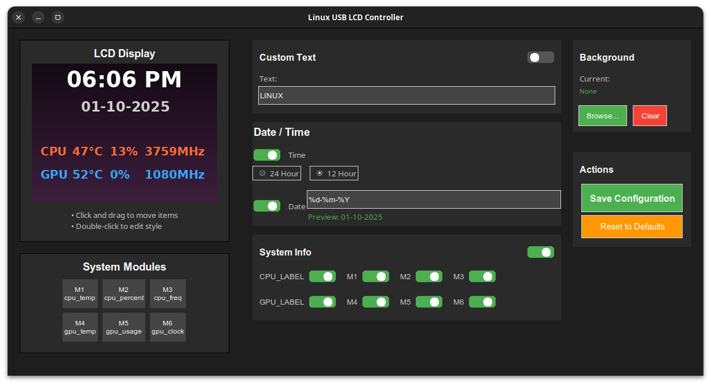
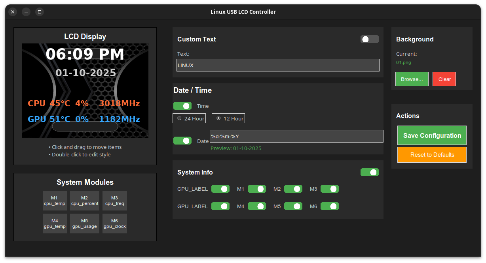
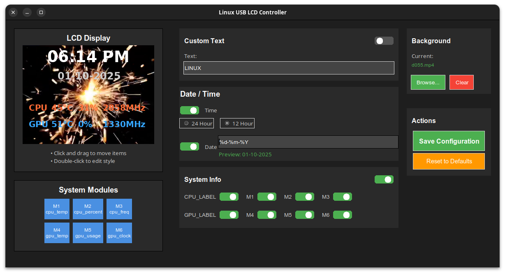
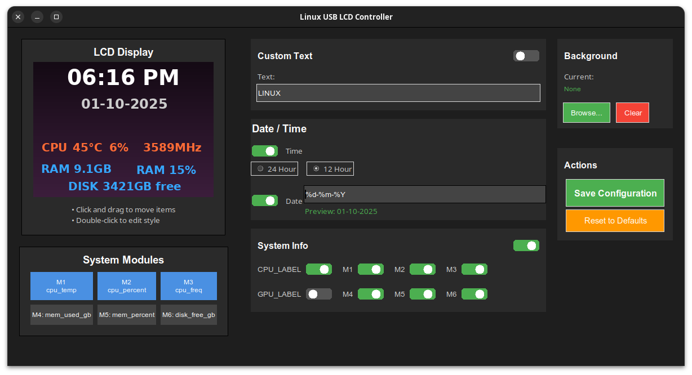
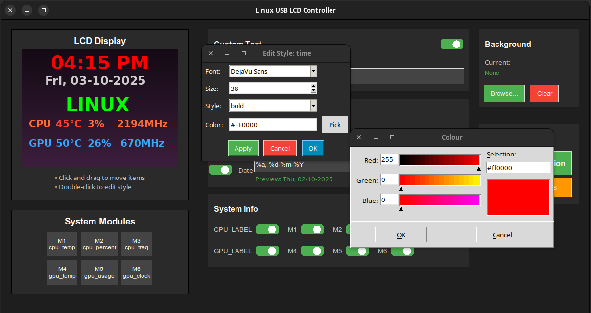

# LCD System Monitor (Linux Driver + GUI)

## 📖 Overview
This project provides a **Linux backend driver** (in C++) and a **Python GUI frontend** for controlling and displaying system info on a USB-connected LCD device.  

This driver is specifically for the Thermalright LCD that idetifies itself as **ALi Corp. USBLCD** and has vid of 0402 and a pid of 3922.  It will not drive any other
Thermalright LCD's.  Thermalright have no intentions of providing a Linux driver (because I asked them) so I did it myself.

This project is a work in progress but it is stable enough now to be used with one caveat - I have not yet figured out how to interrupt the start-up animation, so
users need to wait for the LCD to time out ~1 minute.  There is some code in the driver to do the initial handshake but it's not in a working state yet.

- ✅ Native Linux replacement for the original closed-source Windows tool.  
- ✅ Backend in C++ (handles device comms, config, frame uploads).  
- ✅ Python GUI frontend for preview/testing (swappable for other UIs).  
- ✅ Config stored in JSON, managed by the backend.  

---

## ⚙️ Requirements

### System
- Linux (tested on Ubuntu 24.04, GNOME/Mutter)  
- USB access to the LCD device  

### Build Dependencies

| Dependency | Purpose | Install (Ubuntu/Debian) | Link |
|------------|---------|--------------------------|------|
| **g++ / clang++** | Build C++17 code | `sudo apt install g++` | [GCC](https://gcc.gnu.org/) |
| **CMake ≥ 3.16** | Build system | `sudo apt install cmake` | [CMake](https://cmake.org/download/) |
| **libusb-1.0** | USB device access | `sudo apt install libusb-1.0-0-dev` | [libusb](https://libusb.info/) |
| **Python 3.12+** | Frontend GUI | `sudo apt install python3 python3-dev python3-pip` | [Python](https://www.python.org/) |
| **pybind11** | Python bindings | `pip install pybind11` | [pybind11](https://github.com/pybind/pybind11) |
| **pybind11_json** | JSON conversion | `pip install pybind11_json` | [pybind11_json](https://github.com/pybind/pybind11_json) |
| **nlohmann/json** | JSON handling (C++) | `sudo apt install nlohmann-json3-dev` | [nlohmann/json](https://github.com/nlohmann/json) |
| **OpenCV** | Image/frame processing | `sudo apt install libopencv-dev` | [OpenCV](https://opencv.org/) |

---

## 🔨 Build & Run

### Quick start (one-liner)
```bash
git clone https://github.com/yourname/lcd-sysmon.git
cd lcd-sysmon
mkdir build && cd build
cmake ..
make run
```

👉 `make run` will **build** the backend and **launch** the Python GUI in one step.  

---

### Step-by-step (if you prefer)
```bash
git clone https://github.com/yourname/lcd-sysmon.git
cd lcd-sysmon
mkdir build && cd build
cmake ..
make             # builds the driver + copies gui_controller.py
python3 gui_controller.py
```

---

## 📂 Project Structure

```
lcd-sysmon/
├── src/
│   ├── CLcdDriver.cpp
│   ├── CLcdDriver.h
│   └── bindings.cpp
├── python/
│   └── gui_controller.py
├── CMakeLists.txt
└── README.md
```

---

## ▶️ Usage

- On first run, no `config.json` exists → defaults are provided by the backend.  
- When settings are saved in the GUI, `config.json` is written to the working directory.  
- GUI runs at **25 fps** when focused, slows to conserve CPU when unfocused.  

---

## 🚀 Future Plans
- Alternative frontends (Electron, GTK, etc.).  
- Packaging (`.deb`, Flatpak).  
- Advanced minimize detection under GNOME (Xlib `_NET_WM_STATE_HIDDEN`).

Further dcumentation can be found in the `docs` directory.


## 🖥️ Screenshots










